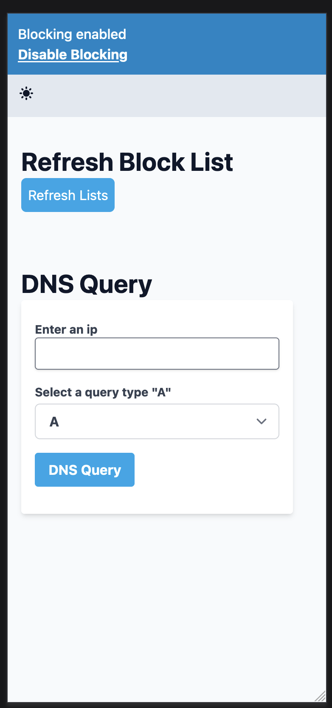
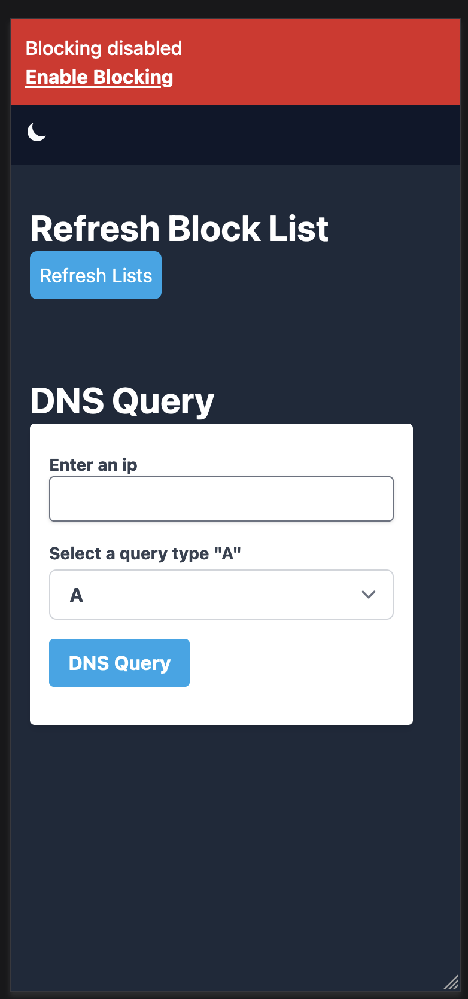

# Blocky Frontend

A frontend for the [blocky](https://github.com/0xERR0R/blocky) dns blocker.

## Screenshots





## Features

- Responsive Design
- Enable / Disable Blocking
- DNS Queries
- Refresh Blocklists

## Run Locally

Clone the project

```bash
  git clone https://github.com/Mozart409/blocky-frontend
```

Go to the project directory

```bash
  cd blocky-frontend
```

Install dependencies

```bash
  pnpm install
```

Start the development server

```bash
  pnpm run dev
```

Production version frontend runs on [http://localhost:8002](http://localhost:8002)

```bash
  docker compose up -d --remove-orphans
```

## Authors

- [@Mozart409](https://www.github.com/mozart409)
