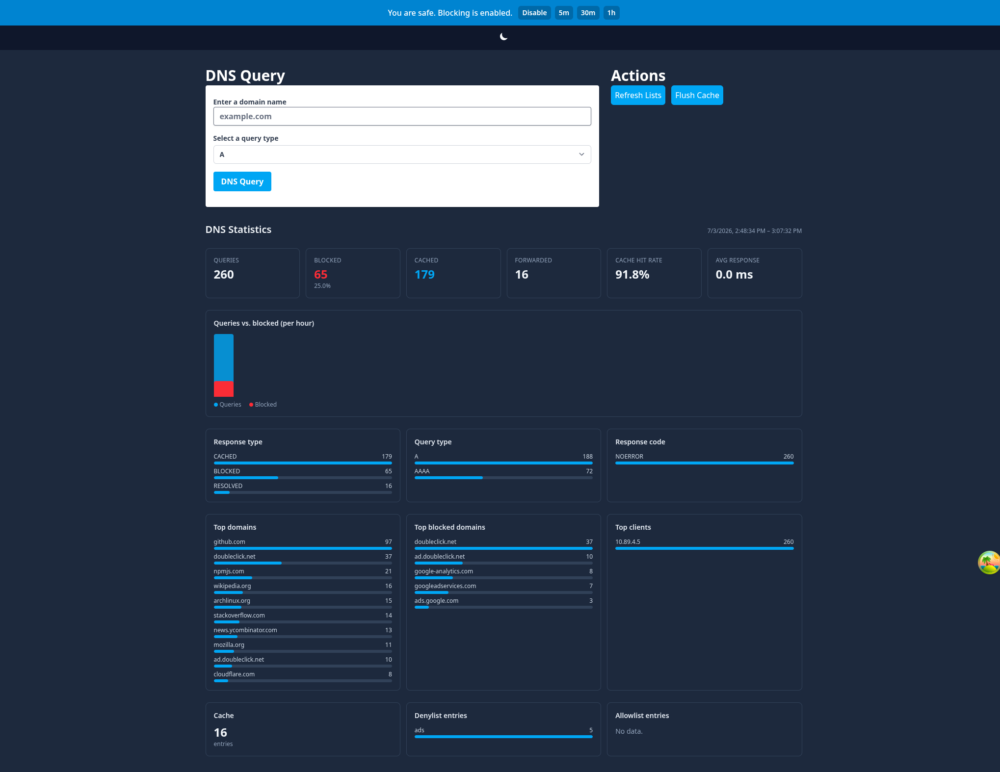
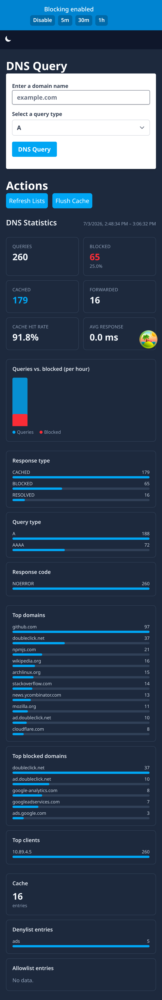

# Blocky Frontend

A frontend for the [blocky](https://github.com/0xERR0R/blocky) dns blocker.

## Screenshots

### Desktop



### Mobile



## Features

- Responsive Design (desktop & mobile)
- Enable / Disable Blocking, with timed pause (5m / 30m / 1h)
- DNS Query tool
- DNS Statistics dashboard (queries, blocked, cache hit rate, top domains/clients, per-hour chart)
- Refresh Blocklists
- Flush DNS Cache

## Run Locally

Clone the project

```bash
  git clone https://github.com/Mozart409/blocky-frontend
```

Go to the project directory

```bash
  cd blocky-frontend
```

Install dependencies

```bash
  pnpm install
```

Start the development server

```bash
  pnpm run dev
```

Change the .env.example to .env.local for local development.

Production version frontend runs on [http://localhost:8002](http://localhost:8002)

```bash
  docker compose up -d --remove-orphans
```

## Authors

- [@Mozart409](https://www.github.com/mozart409)
